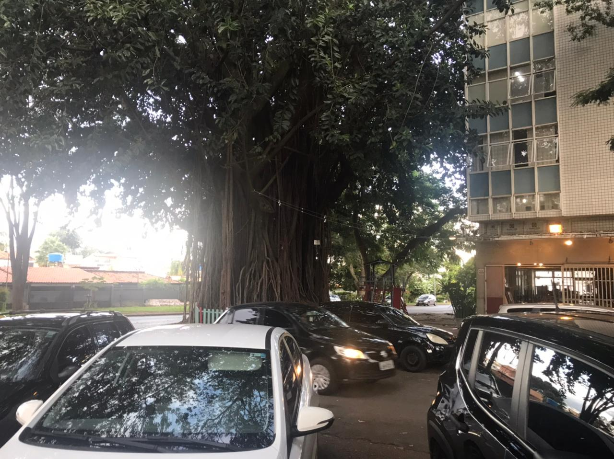
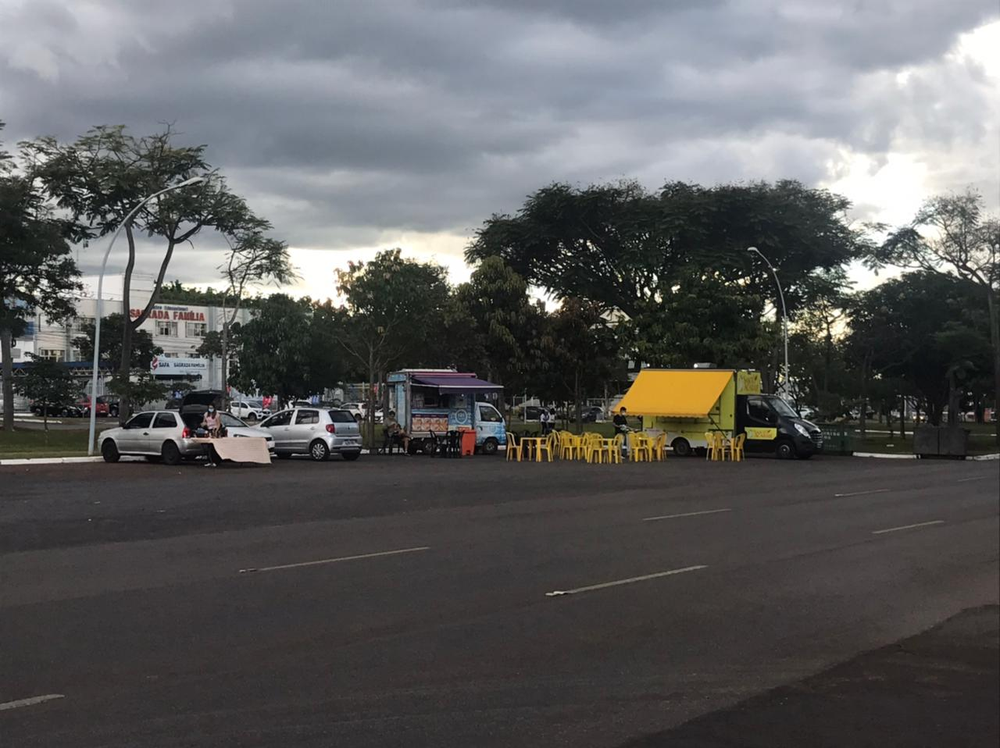
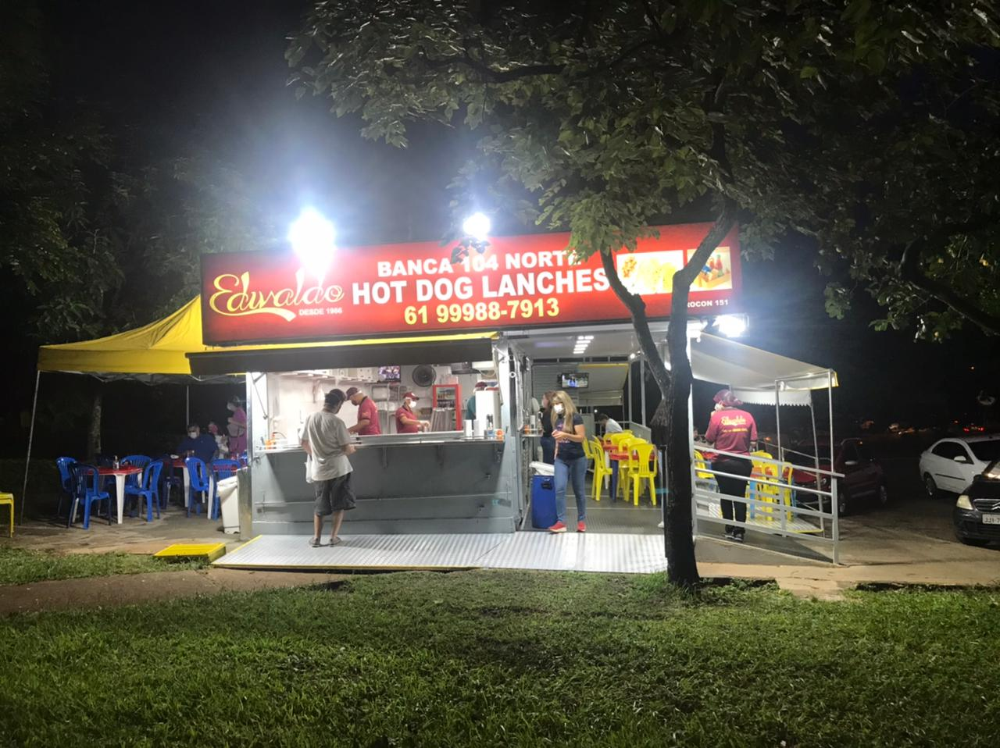
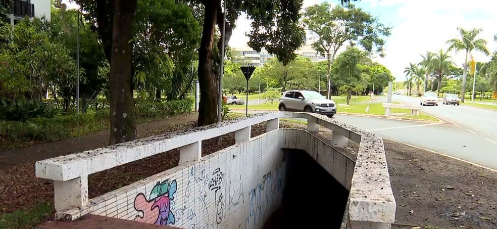
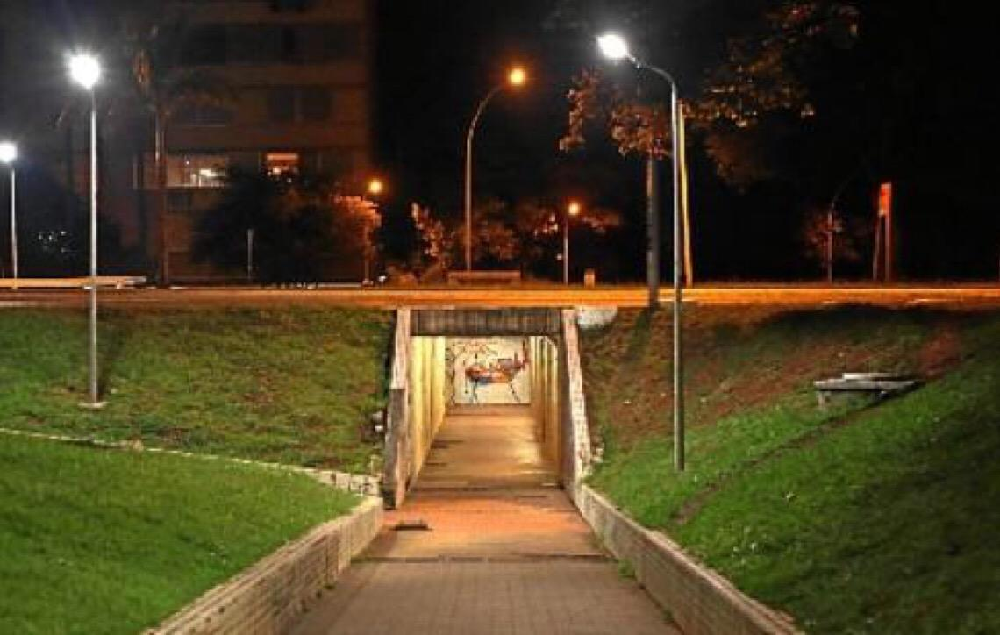
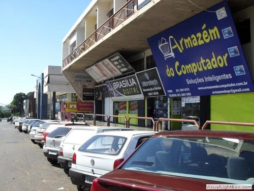
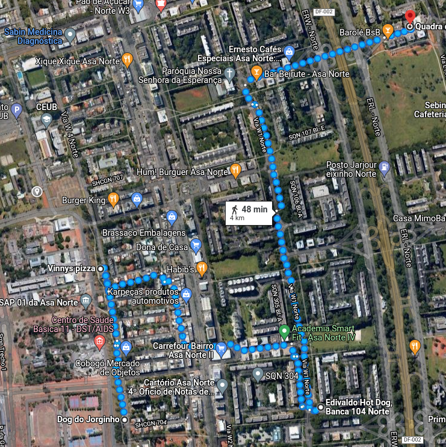

# Atividade Deriva

## Sobre

O flanêur é	o	principal	elemento	inspirador	para	esta	atividade.	A	atividade	consiste	em	
realizar	uma	deriva	fotográfica,	em	local	aberto	e	ventilado	na	cidade	ou	mesmo	em	casa,	para	
quem	não	pode	ou	não	deseja	sair.

Para essa atividade escolhi um caminho um pouco incomum passando por ciclovias, entrequadras e comércios dos mais variados. Sem mais delongas vamos inicar essa caminha sem rumo ou fim.

### Árvore da 704

Essa árvore não é famosa, mas ela está nessa quadra a muito tempo. Já foi ameaçada de ser podada algumas vezes por está atrapalhando a passagem de pedestres. Porém, ela permaneceu lá por agradar os moradores locais.

<iframe src="https://www.google.com/maps/embed?pb=!1m18!1m12!1m3!1d700.8063289183087!2d-47.89117917575449!3d-15.775065870203312!2m3!1f0!2f0!3f0!3m2!1i1024!2i768!4f13.1!3m3!1m2!1s0x935a3a508ab3c10b%3A0xc62d47fef96abdff!2sCobog%C3%B3%20Mercado%20de%20Objetos!5e1!3m2!1spt-BR!2sbr!4v1645093549112!5m2!1spt-BR!2sbr" width="600" height="450" style="border:0;" allowfullscreen="" loading="lazy"></iframe>

### Rede de food trucks

Eu passei essa ciclovia toda semana e vi ela ganhar mais vida com essa nova tendência de food trucks. Devo dizer que é ótimo ter uma lugar aberto para comer uma comida diferente, oque as vezes me dá forças para sair de casa e aproveitar as ruas.

<iframe src="https://www.google.com/maps/embed?pb=!1m18!1m12!1m3!1d1919.804538195021!2d-47.8929806418181!3d-15.7718063160362!2m3!1f0!2f0!3f0!3m2!1i1024!2i768!4f13.1!3m3!1m2!1s0x935a3ba71343066f%3A0x7e09e9137545398!2sVinnys%20pizza!5e0!3m2!1spt-BR!2sbr!4v1645093477494!5m2!1spt-BR!2sbr" width="600" height="450" style="border:0;" allowfullscreen="" loading="lazy"></iframe>

### Banca de revista

Isso é uma barraca de cachorro-quente, mas até o ano passado havia uma loja de produtos orgânicos e antes disso uma velha banca de revista. Acredito que essas bancas vem se tornando algo cada vez mais difícil de encontrar por conta da tecnologia e o desuso de revistas e afins.

<iframe src="https://www.google.com/maps/embed?pb=!1m18!1m12!1m3!1d1401.5986065057045!2d-47.88458453122295!3d-15.777098995017486!2m3!1f0!2f0!3f0!3m2!1i1024!2i768!4f13.1!3m3!1m2!1s0x935a3a54841dc6d7%3A0x42cd14c046ea7880!2sEdivaldo%20Hot%20Dog%2C%20Banca%20104%20Norte!5e1!3m2!1spt-BR!2sbr!4v1645093590255!5m2!1spt-BR!2sbr" width="600" height="450" style="border:0;" allowfullscreen="" loading="lazy"></iframe>

### Passarela do medo

imagem 1 | imagem 2
:----:|:----:
 | 

Essa passarela subterrânea é famosa no plano. Já foi lugar de muitos crimes e outros assuntos preocupantes para não dizer nada explícito. Porém, muitas pessoas ainda a utilizam para evitar os carros que passam por cima.

<iframe src="https://www.google.com/maps/embed?pb=!1m18!1m12!1m3!1d4714.680819308747!2d-47.885472684588166!3d-15.764884926431062!2m3!1f0!2f0!3f0!3m2!1i1024!2i768!4f13.1!3m3!1m2!1s0x935a3a4b40dfb27f%3A0x7c1e75a0abfa1057!2sAsa%20Norte%20-%20Bras%C3%ADlia%2C%20DF%2C%2070297-400!5e1!3m2!1spt-BR!2sbr!4v1645093755627!5m2!1spt-BR!2sbr" width="600" height="450" style="border:0;" allowfullscreen="" loading="lazy"></iframe>

### Quadra da informáfica

Essa quadra é muito conhecida também. Se você precisa de assitência tecnica ou comprar algum eletrônico esse é o lugar. A quadra é uma polo de hardware e software para quem precisa de algo do mesmo.

<iframe src="https://www.google.com/maps/embed?pb=!1m18!1m12!1m3!1d4714.713124340584!2d-47.88305168458819!3d-15.76349422639651!2m3!1f0!2f0!3f0!3m2!1i1024!2i768!4f13.1!3m3!1m2!1s0x935a3bcd2330000b%3A0x6bb9f7858e721b3a!2sQuadra%20da%20Informatica!5e1!3m2!1spt-BR!2sbr!4v1645093777041!5m2!1spt-BR!2sbr" width="600" height="450" style="border:0;" allowfullscreen="" loading="lazy"></iframe>

## A trilha

## Versionamento

| Versão | Data| Modificação |Autor|
| :--: | :--: | :--: | :--:|
| 1.0  | 17/02/2022 | Criação da deriva | Victor Yukio |
| 1.1  | 17/02/2022 | Correção das iamgens | Victor Yukio |