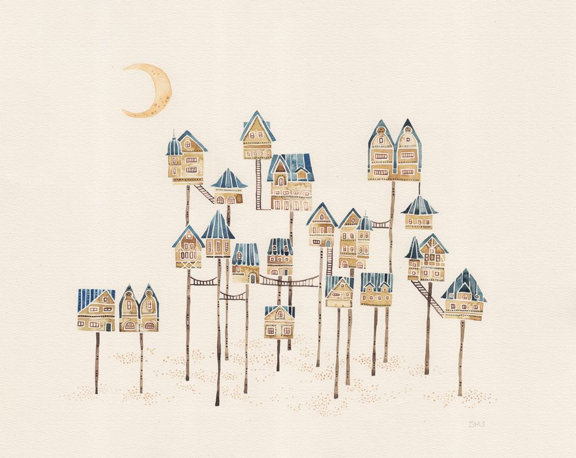
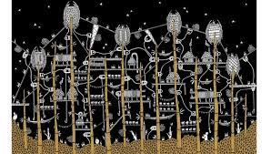
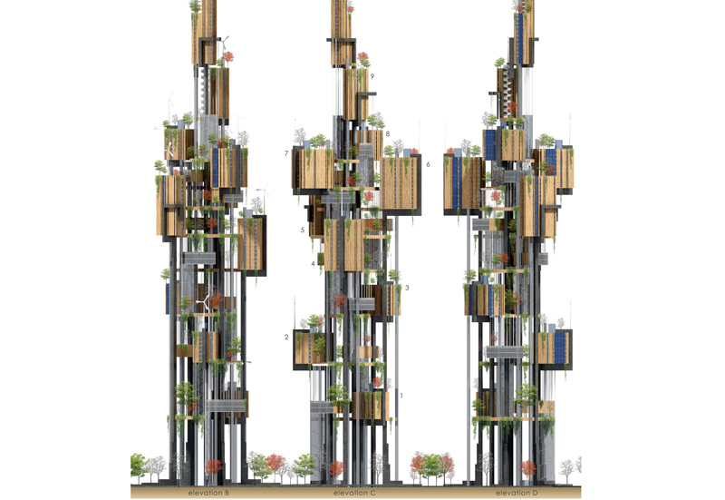
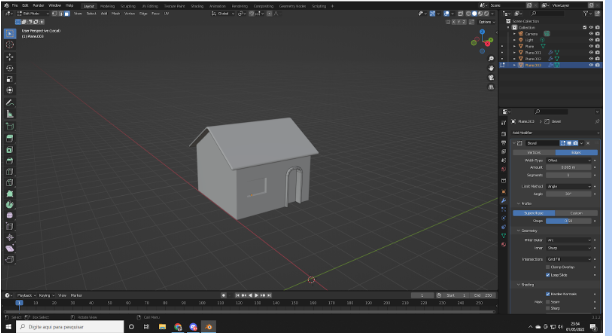
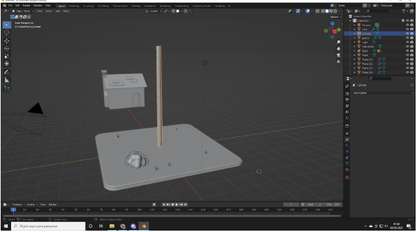
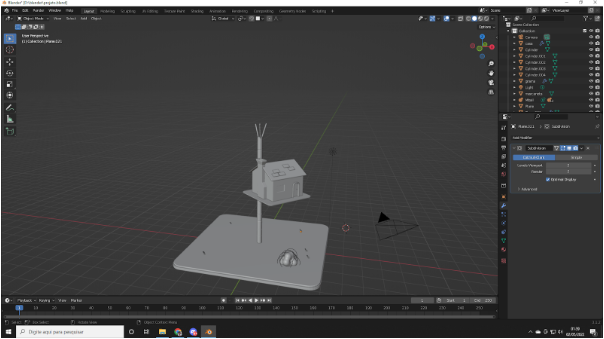
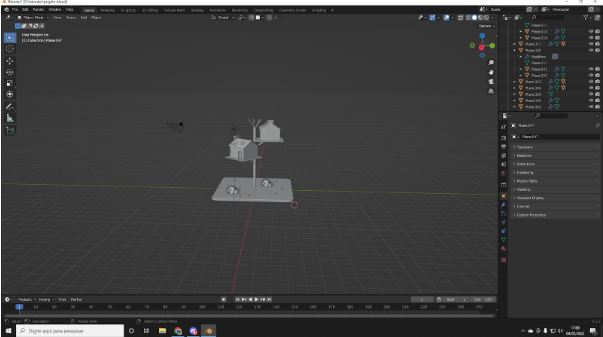
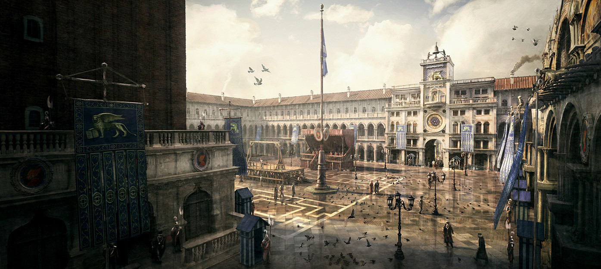

# Projeto Final Estudo dirigido de Design

## Obra escolhida: Ítalo Calvino - Cidades Invisíveis

Durante as aulas de estudo dirigido de design a obra de Ítalo Calvino foi a que mais me chamou atenção. Os relatos que o aventureiro Marco Polo conta ao descrever as cidade pela qual viaja e suas respectivas arquiteturas, atiçaram minha imaginação e me levaram a explorar mais as reflexões, experiências e conjeturas que o mesmo passa.
A descrição das cidades me lembrou muito também da descrição ao ambientar um cenário de RPG de mesa (role playing game). Ambos trazem imersão e constroem o ambiente com as palavras. E devido a essa lembraça a leitura me marcou e tal forma que escolhi como tema do projeto final.

### Zenobia

Dentre as várias cidades (55) do texto escolhi a cidade de Zenobia pois foi a que mais me chamou atenção. Ao imaginar a arquitetura imaginei algo bem oriental e moderno, característica que está presente em minha pessoa. Zenobia é classificada com uma cidade delgada. A palavra delgado diz respeito a algo esbelto, fino e delicado.

Feita de casas de Zinco construidas sobre estacas de bambu, apesar da aparẽncia frágil a construção é bem resistênte e moderna. A cidade não é classificada como triste ou feliz, o livro diz que ela é o que ela deveria ser.

Construida em cima de um rio seco, a cidade representa a ideia de torna sonhos em realidade. Construir um cidade com pouco rercurso hídrico não é fácil, mas com força de vontade e persistência qualquer coisa é possível. Todos esses traços fazem de Zenobia uma cidade única, com uma proposta inovadora livre dos concretos armados ou uma "floresta de pedra e metal". 

Pesquisando mais sobre descobri um artista peruano que recriou as 55 cidades invisíveis de Italo Calvino. A artista Karina Puente fez sua própria interpretação das cidades entre elas está Zenobia apersentada abaixo.

"O projeto começou em 2014, quando a arquiteta se viu cansada de projetar residências privadas e iniciou um projeto urbanístico junto à prefeitura de Lima. Em casa, desenhava as partes da cidade que visitava durante o trabalho, entre casas, edifícios, favelas e lojas. O hábito trouxe à lembrança a obra de Calvino, que lera na faculdade – e que, ao reler, a fez 'explodir de criatividade'".

### Projetos de Zenobia se tornam realidade

O designer Alessandro Tonni e Manuela Spera criaram um ponto de encontro entre a arquitetura e a literatura 
englobando e reinterpretando uma das imagens surreais mais sugestivas de Ítalo Calvino. 

### Modelagem 3D da arquitetura de Zenobia

Como parte do projeto criei minha própria interpretação da arquitetura de Zenobia feita com Blender. Ferramenta de modelagem 3D. Nessa sessão irei mostrar o processo de confecção e o produto final da obra.

### Etapas do processo

* ## Início

* ## Meio

* ## Final

* ## Ajustes, Efeitos e Coloração

## Projeto 3D

 <iframe title="Bamboo house" frameborder="0" allowfullscreen mozallowfullscreen="true" webkitallowfullscreen="true" allow="autoplay; fullscreen; xr-spatial-tracking" xr-spatial-tracking execution-while-out-of-viewport execution-while-not-rendered web-share src="https://sketchfab.com/models/fa623f2c8e1b46e29e4025ce13b65169/embed"> </iframe> 
 <a href="https://sketchfab.com/3d-models/bamboo-house-fa623f2c8e1b46e29e4025ce13b65169?utm_medium=embed&utm_campaign=share-popup&utm_content=fa623f2c8e1b46e29e4025ce13b65169" target="_blank" style="font-weight: bold; color: #1CAAD9;"> Bamboo house </a> by <a href="https://sketchfab.com/yukio.link?utm_medium=embed&utm_campaign=share-popup&utm_content=fa623f2c8e1b46e29e4025ce13b65169" target="_blank" style="font-weight: bold; color: #1CAAD9;"> yukio.link </a> on <a href="https://sketchfab.com?utm_medium=embed&utm_campaign=share-popup&utm_content=fa623f2c8e1b46e29e4025ce13b65169" target="_blank" style="font-weight: bold; color: #1CAAD9;">Sketchfab</a>

## Sobre a ferramente Blender

O Blender é uma ferramenta que permite a criação de vastos conteúdos de 3D. Oferece funcionalidades completas para modelagem, renderização, animação. Muito utilizado no design de jogos o desenvolvedor pode construir cidades tão realisticas quanto da vida real.

<iframe width="560" height="315" src="https://www.youtube.com/embed/JjnyapZ_P-g" title="YouTube video player" frameborder="0" allow="accelerometer; autoplay; clipboard-write; encrypted-media; gyroscope; picture-in-picture" allowfullscreen></iframe>

Arquitetura dentro do jogo Assasin Creed.

## Referências

- https://revistacult.uol.com.br/home/peruana-quer-ilustrar-cidades-invisiveis-de-calvino/ , acessado em 04/05/2022.

- https://www.evolo.us/reinterpreting-italo-calvinos-zenobia/, acessado em 04/05/2022.

- https://www.trabalhosfeitos.com/ensaios/Zenobia-Italo-Calvino/43343595.html, acessado em 04/05/2022

## Versionamento

| Versão | Data| Modificação |Autor|
| :--: | :--: | :--: | :--:|
| 1.0  | 04/05/2022 | Criação do projeto | Victor Yukio |
| 2.0  | 05/05/2022 | Adição de novos conteúdos | Victor Yukio |